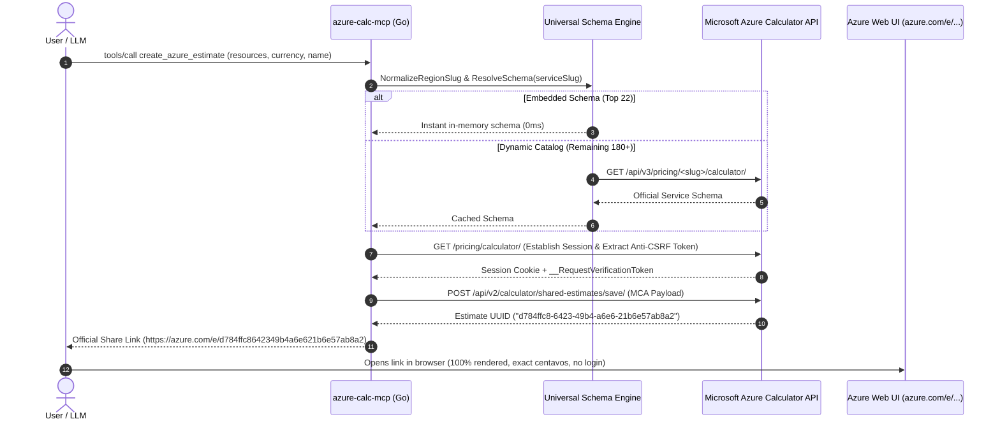

# Azure Pricing Calculator MCP Server

<p align="center">
  <a href="README.md"><b>English</b></a> &nbsp;|&nbsp; <a href="README.pt-BR.md"><b>Português</b></a>
</p>

<p align="center">
  
  
  
  
</p>

A high-performance, single-binary **Model Context Protocol (MCP)** server written in **Go (Golang)** that enables AI assistants (**Claude Desktop, Cursor, Codex, Claude Code**) to automatically generate **official, permanent, and shareable Microsoft Azure Pricing Calculator estimates (`https://azure.com/e/...`)** directly from natural language prompts.

---

## Key Highlights & Engineering Breakthroughs

1. **Universal Coverage (200+ Azure Services):**
   - **Tier 1 (Instant 0ms):** Top 22 enterprise services pre-compiled with embedded official schemas (AKS, PostgreSQL Flexible, MySQL, Cosmos DB, Azure OpenAI / Cognitive Services, Container Apps, App Service, Functions, Storage GPv2, Key Vault, Azure Monitor, Application Gateway, VPN Gateway, Azure Firewall, Bastion, Redis, Service Bus, Event Hubs, APIM, DNS, VMs, and Azure SQL).
   - **Tier 2 (Universal Dynamic Engine):** Automatically resolves and caches official schemas for all remaining 180+ Azure services on-demand via Azure's public calculator endpoints (`/api/v3/pricing/<slug>/calculator/`).
2. **Zero Login Barriers (Bypass MOSA Prompt):**
   - Standard calculator exports often default to `mosp`, forcing viewers into a Microsoft Online Subscription Program authentication modal. This server defaults to `priceLevelId: "mca"` (*Microsoft Customer Agreement*), ensuring links **open instantly and cleanly for anyone without requiring a login**.
3. **Automatic Slug & Region Normalization:**
   - Azure Resource Manager (ARM) names like `brazilsouth` or `eastus` cause React runtime exceptions in the calculator frontend. The normalizer automatically maps regions to their required kebab-case slugs (`brazil-south`, `us-east-2`, `europe-west`, etc.).
4. **State Integrity (`hasPricing: true`):**
   - Injects mandatory flags and structural schemas preventing the dreaded *"Pricing is not available for your selection in this region"* warning.
5. **Built with Test-Driven Development (TDD):**
   - Robust test suite with 100% passing tests for normalization, building logic, schema cloning, and JSON-RPC protocol compliance. Executes in **under 0.10s**.

---

## Architecture & How It Works



### Component Structure
- [`azure/models.go`](file:///azure/models.go): Data models, payload structures, MCA defaults, and resource inputs.
- [`azure/normalizer.go`](file:///azure/normalizer.go): Kebab-case mapping for regions, VM SKUs, and service aliases.
- [`azure/schemas.go`](file:///azure/schemas.go): Dynamic schema resolver with 20+ embedded enterprise schemas and online fallback.
- [`azure/builder.go`](file:///azure/builder.go): Universal instance builder with smart defaults for AKS, Postgres, Storage, OpenAI, Cosmos DB, and generic passthroughs (`extra`).
- [`azure/client.go`](file:///azure/client.go): HTTP client managing cookie jars, anti-CSRF token scraping, and estimate persistence.
- [`mcp/server.go`](file:///mcp/server.go): Stdio JSON-RPC 2.0 MCP server implementing `initialize`, `tools/list`, and `tools/call`.

---

## Quick Start & Installation

### Method 1: One-Line Auto-Installer (Recommended)

Run a single command in your terminal. It downloads the native binary, installs it to your local application directory, and automatically configures Claude Desktop and Cursor.

**Windows (PowerShell):**
```powershell
irm https://raw.githubusercontent.com/kandiesky/azure-calc-mcp/main/install.ps1 | iex
```

**macOS / Linux (Bash):**
```bash
curl -fsSL https://raw.githubusercontent.com/kandiesky/azure-calc-mcp/main/install.sh | bash
```

---

### Method 2: NPX Auto-Installer & Runner

If you have Node.js installed, you can configure everything automatically with:
```bash
npx azure-calc-mcp install
```

Or configure Claude Desktop directly using `npx` without manual downloads:
```json
{
  "mcpServers": {
    "azure-calc": {
      "command": "npx",
      "args": ["-y", "azure-calc-mcp"]
    }
  }
}
```

---

### Method 3: Manual Configuration (Precompiled Binary)

Download the binary from [GitHub Releases](https://github.com/kandiesky/azure-calc-mcp/releases) and add it to your AI tool configuration:

**Claude Desktop:**
- **Windows:** `%APPDATA%\Claude\claude_desktop_config.json`
- **macOS:** `~/Library/Application Support/Claude/claude_desktop_config.json`
- **Linux:** `~/.config/Claude/claude_desktop_config.json`

```json
{
  "mcpServers": {
    "azure-calc": {
      "command": "C:\\path\\to\\azure-calc-mcp.exe"
    }
  }
}
```

**Cursor / Codex:**
In Cursor Settings -> **Features** -> **MCP Servers** -> **Add New MCP Server**:
- **Name:** `azure-calc`
- **Type:** `command`
- **Command:** `C:\path\to\azure-calc-mcp.exe`

---

### Method 4: Build from Source
```bash
git clone https://github.com/kandiesky/azure-calc-mcp.git
cd azure-calc-mcp
go build -o azure-calc-mcp.exe main.go
```

---

## MCP Tools Reference

### `create_azure_estimate`
Generates an official Azure Pricing Calculator share link.

**Parameters:**
- `name` *(string, optional)*: Descriptive estimate title (e.g., `"Production Architecture v1"`).
- `currency` *(string, optional)*: Currency code (`"BRL"`, `"USD"`, `"EUR"`, etc. Default: `"BRL"`).
- `resources` *(array, required)*: List of resources to include.
  - `service` *(string, required)*: Service identifier (e.g., `"aks"`, `"postgresql"`, `"storage"`, `"vm"`, `"cosmos-db"`, `"cognitive-services"`, `"application-gateway"`).
  - `name` *(string, optional)*: Custom display name for this card.
  - `region` *(string, optional)*: Azure region (`"brazilsouth"`, `"eastus"`, etc. Default: `"brazil-south"`).
  - `quantity` *(integer, optional)*: Node count, VM instances, or server count (Default: `1`).
  - `hours` *(integer, optional)*: Operational hours per month (Default: `730` for 24/7).
  - `sku` *(string, optional)*: VM SKU or node size (e.g., `"d2sv5"`, `"d4s_v5"`, `"b2s"`).
  - `tier` *(string, optional)*: Service tier (`"burstable"`, `"standard"`, `"general-purpose"`).
  - `storageGb` *(integer, optional)*: Capacity in GB/GiB.
  - `redundancy` *(string, optional)*: Storage redundancy (`"lrs"`, `"zrs"`, `"grs"`).
  - `accessTier` *(string, optional)*: Blob access tier (`"hot"`, `"cool"`, `"archive"`).
  - `diskTier` *(string, optional)*: OS/Data disk tier (`"standardssd"`, `"premiumssd"`).
  - `diskSize` *(string, optional)*: Disk size (`"e10"`, `"p10"`, `"p15"`, `"p20"`).
  - `clusterCount` *(integer, optional)*: Number of AKS clusters.
  - `slaOption` *(string, optional)*: AKS SLA (`"no-sla-free-non-production"` or `"sla"`).
  - `extra` *(object, optional)*: Arbitrary raw parameters passed directly to the Azure service schema.

### `list_azure_services`
Returns all pre-compiled enterprise services and describes how to target any of the 200+ Azure services.

---

## Example Prompt for AI Assistants

You can prompt your AI in natural language:

> *"Generate an Azure pricing estimate in BRL for Brazil South titled 'E-Commerce Production':*
> - *1 AKS cluster with 3 nodes D4s_v5 Linux and Standard SSD OS disks.*
> - *1 PostgreSQL Flexible Server Burstable B2ms with 64 GB Premium SSD.*
> - *1 Storage Account Blob Hot LRS with 500 GB.*
> - *1 Key Vault with standard operations.*
> - *Azure Monitor with 2 GB/day log ingestion.*
> *Give me the official shareable calculator link."*

---

## Test-Driven Development (TDD)

Run the automated test suite:
```powershell
go test -v ./...
```

**Output:**
```text
=== RUN   TestBuildVMInstance
--- PASS: TestBuildVMInstance (0.00s)
=== RUN   TestBuildAKSInstance
--- PASS: TestBuildAKSInstance (0.00s)
=== RUN   TestBuildPostgresInstance
--- PASS: TestBuildPostgresInstance (0.00s)
=== RUN   TestBuildStorageInstance
--- PASS: TestBuildStorageInstance (0.00s)
=== RUN   TestBuildGenericInstanceWithExtra
--- PASS: TestBuildGenericInstanceWithExtra (0.00s)
=== RUN   TestNewEstimatePayload
--- PASS: TestNewEstimatePayload (0.00s)
=== RUN   TestTokenRegexExtraction
--- PASS: TestTokenRegexExtraction (0.00s)
=== RUN   TestPayloadJSONSerialization
--- PASS: TestPayloadJSONSerialization (0.00s)
=== RUN   TestNormalizeRegionSlug
--- PASS: TestNormalizeRegionSlug (0.00s)
=== RUN   TestNormalizeServiceSlug
--- PASS: TestNormalizeServiceSlug (0.00s)
=== RUN   TestGetDefaultSchemaEmbedded
--- PASS: TestGetDefaultSchemaEmbedded (0.00s)
=== RUN   TestSchemaCloneMapIndependence
--- PASS: TestSchemaCloneMapIndependence (0.00s)
=== RUN   TestListEmbeddedServices
--- PASS: TestListEmbeddedServices (0.00s)
PASS
ok      azure-calc-mcp/azure    0.089s
=== RUN   TestFormatEstimateResponse
--- PASS: TestFormatEstimateResponse (0.00s)
=== RUN   TestJSONRPCSerialization
--- PASS: TestJSONRPCSerialization (0.00s)
PASS
ok      azure-calc-mcp/mcp      0.065s
```

---

## License

MIT License. Developed for enterprise-wide cloud architecture automation.
