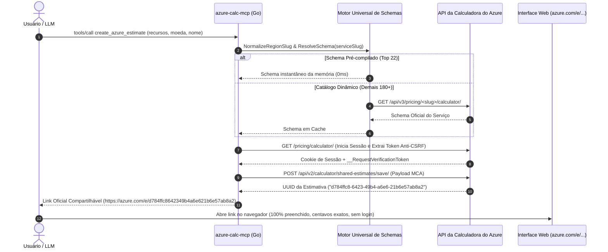

# Servidor MCP para Calculadora de Preços do Azure ⚡

<p align="center">
  <strong>[🇺🇸 English](README.md) | [🇧🇷 Português](README.pt-BR.md)</strong>
</p>

<p align="center">
  
  
  
  
</p>

Servidor **Model Context Protocol (MCP)** de binário único de alta performance escrito em **Go (Golang)** que permite que assistentes de Inteligência Artificial (**Claude Desktop, Cursor, Codex, Claude Code**) gerem automaticamente **links oficiais, permanentes e compartilháveis da Calculadora de Preços do Azure (`https://azure.com/e/...`)** diretamente a partir de solicitações em linguagem natural.

---

## 🌟 Principais Destaques e Descobertas Técnicas

1. **Cobertura Universal (Mais de 200 Serviços do Azure):**
   - **Nível 1 (Instantâneo 0ms):** Os 22 principais serviços corporativos já vêm pré-compilados com seus schemas oficiais embutidos no binário (AKS, PostgreSQL Flexible, MySQL, Cosmos DB, Azure OpenAI / Cognitive Services, Container Apps, App Service, Functions, Storage GPv2, Key Vault, Azure Monitor, Application Gateway, VPN Gateway, Azure Firewall, Bastion, Redis, Service Bus, Event Hubs, APIM, DNS, VMs e Azure SQL).
   - **Nível 2 (Motor Dinâmico Universal):** Baixa e armazena em cache automaticamente os schemas de qualquer um dos outros 180+ serviços sob demanda via endpoints públicos da Microsoft (`/api/v3/pricing/<slug>/calculator/`).
2. **Sem Barreira de Login (Bypass do Modal MOSA):**
   - Estimativas salvas com a configuração padrão frequentemente usam `mosp`, o que força quem abre o link a ver uma tela de login corporativo da Microsoft. Este servidor usa por padrão `priceLevelId: "mca"` (*Microsoft Customer Agreement*), garantindo que os links **abram imediatamente para qualquer cliente ou colega sem exigir login**.
3. **Normalização Automática de Regiões e Slugs:**
   - Nomes de regiões do ARM como `brazilsouth` ou `eastus` provocam erros no React da calculadora web. O normalizador converte automaticamente para o padrão *kebab-case* exigido (`brazil-south`, `us-east-2`, `europe-west`, etc.).
4. **Integridade de Estado (`hasPricing: true`):**
   - Injeta propriedades obrigatórias que evitam o alerta amarelo de *"O preço não está disponível para sua seleção nessa região"*.
5. **Desenvolvido com TDD (Test-Driven Development):**
   - Suíte completa de testes unitários e de integração validando 100% das regras de negócio, resolução de schemas e protocolo JSON-RPC em **menos de 0.10 segundo**.

---

## 📐 Arquitetura e Como Funciona



### Estrutura de Código
- [`azure/models.go`](file:///azure/models.go): Estruturas de dados, modelo de payload, padrões de licenciamento MCA e tipos de entrada.
- [`azure/normalizer.go`](file:///azure/normalizer.go): Mapeamento de regiões kebab-case, SKUs de VMs e aliases de serviços.
- [`azure/schemas.go`](file:///azure/schemas.go): Resolvedor dinâmico com mais de 20 schemas enterprise embutidos e fallback online.
- [`azure/builder.go`](file:///azure/builder.go): Construtor universal com regras para AKS, Postgres, Storage, OpenAI, Cosmos DB e injeção genérica (`extra`).
- [`azure/client.go`](file:///azure/client.go): Cliente HTTP com cookie jar, scraping de tokens anti-CSRF e persistência de snapshots.
- [`mcp/server.go`](file:///mcp/server.go): Servidor MCP stdio JSON-RPC 2.0 implementando `initialize`, `tools/list` e `tools/call`.

---

## 🚀 Instalação e Configuração

### 1. Claude Desktop
Adicione o servidor no arquivo de configuração do Claude Desktop:
- **Windows:** `%APPDATA%\Claude\claude_desktop_config.json`
- **macOS:** `~/Library/Application Support/Claude/claude_desktop_config.json`

```json
{
  "mcpServers": {
    "azure-calc": {
      "command": "C:\\caminho\\para\\azure-calc-mcp.exe"
    }
  }
}
```

### 2. Cursor / Codex
Nas configurações do Cursor ➔ **Features** ➔ **MCP Servers** ➔ **Add New MCP Server**:
- **Name:** `azure-calc`
- **Type:** `command`
- **Command:** `C:\caminho\para\azure-calc-mcp.exe`

### 3. Compilar a partir do Código Fonte
```bash
git clone https://github.com/kandiesky/azure-calc-mcp.git
cd azure-calc-mcp
go build -o azure-calc-mcp.exe main.go
```

---

## 🛠️ Referência das Ferramentas MCP

### `create_azure_estimate`
Gera o link oficial compartilhável da Calculadora de Preços do Azure.

**Parâmetros:**
- `name` *(string, opcional)*: Nome descritivo da estimativa (ex: `"Ambiente de Produção DEV v1"`).
- `currency` *(string, opcional)*: Código da moeda (`"BRL"`, `"USD"`, `"EUR"`, etc. Padrão: `"BRL"`).
- `resources` *(array, obrigatório)*: Lista de recursos a incluir:
  - `service` *(string, obrigatório)*: Identificador do serviço (ex: `"aks"`, `"postgresql"`, `"storage"`, `"vm"`, `"cosmos-db"`, `"cognitive-services"`, `"application-gateway"`).
  - `name` *(string, opcional)*: Nome de exibição customizado para o card.
  - `region` *(string, opcional)*: Região do Azure (`"brazilsouth"`, `"eastus"`, etc. Padrão: `"brazil-south"`).
  - `quantity` *(integer, opcional)*: Quantidade de nós, VMs ou instâncias (Padrão: `1`).
  - `hours` *(integer, opcional)*: Horas ativas por mês (Padrão: `730` para 24/7).
  - `sku` *(string, opcional)*: SKU da VM ou tamanho do nó (ex: `"d2sv5"`, `"d4s_v5"`, `"b2s"`).
  - `tier` *(string, opcional)*: Nível do serviço (`"burstable"`, `"standard"`, `"general-purpose"`).
  - `storageGb` *(integer, opcional)*: Capacidade em GB/GiB.
  - `redundancy` *(string, opcional)*: Redundância (`"lrs"`, `"zrs"`, `"grs"`).
  - `accessTier` *(string, opcional)*: Camada de acesso do Blob (`"hot"`, `"cool"`, `"archive"`).
  - `diskTier` *(string, opcional)*: Camada de disco OS/Dados (`"standardssd"`, `"premiumssd"`).
  - `diskSize` *(string, opcional)*: Tamanho do disco (`"e10"`, `"p10"`, `"p15"`, `"p20"`).
  - `clusterCount` *(integer, opcional)*: Contagem de clusters AKS.
  - `slaOption` *(string, opcional)*: SLA do AKS (`"no-sla-free-non-production"` ou `"sla"`).
  - `extra` *(object, opcional)*: Parâmetros arbitrários repassados diretamente ao schema oficial da Microsoft.

### `list_azure_services`
Retorna todos os serviços enterprise com schemas pré-compilados e explica como utilizar qualquer um dos 200+ serviços do catálogo.

---

## 💬 Exemplo de Prompt para o Assistente

Você pode pedir para a sua IA em linguagem natural:

> *"Gere uma estimativa de preços do Azure em BRL para Brazil South chamada 'Arquitetura E-Commerce':*
> - *1 cluster AKS com 3 nós D4s_v5 Linux e discos OS Standard SSD.*
> - *1 PostgreSQL Flexible Server Burstable B2ms com 64 GB SSD Premium.*
> - *1 Storage Account Blob Hot LRS com 500 GB.*
> - *1 Key Vault com operações standard.*
> - *Azure Monitor com 2 GB/dia de ingestão de logs.*
> *Me forneça o link oficial da calculadora."*

---

## 🧪 Desenvolvimento Orientado a Testes (TDD)

Execute a suíte de testes automatizados:
```powershell
go test -v ./...
```

**Resultado:**
```text
=== RUN   TestBuildVMInstance
--- PASS: TestBuildVMInstance (0.00s)
=== RUN   TestBuildAKSInstance
--- PASS: TestBuildAKSInstance (0.00s)
=== RUN   TestBuildPostgresInstance
--- PASS: TestBuildPostgresInstance (0.00s)
=== RUN   TestBuildStorageInstance
--- PASS: TestBuildStorageInstance (0.00s)
=== RUN   TestBuildGenericInstanceWithExtra
--- PASS: TestBuildGenericInstanceWithExtra (0.00s)
=== RUN   TestNewEstimatePayload
--- PASS: TestNewEstimatePayload (0.00s)
=== RUN   TestTokenRegexExtraction
--- PASS: TestTokenRegexExtraction (0.00s)
=== RUN   TestPayloadJSONSerialization
--- PASS: TestPayloadJSONSerialization (0.00s)
=== RUN   TestNormalizeRegionSlug
--- PASS: TestNormalizeRegionSlug (0.00s)
=== RUN   TestNormalizeServiceSlug
--- PASS: TestNormalizeServiceSlug (0.00s)
=== RUN   TestGetDefaultSchemaEmbedded
--- PASS: TestGetDefaultSchemaEmbedded (0.00s)
=== RUN   TestSchemaCloneMapIndependence
--- PASS: TestSchemaCloneMapIndependence (0.00s)
=== RUN   TestListEmbeddedServices
--- PASS: TestListEmbeddedServices (0.00s)
PASS
ok      azure-calc-mcp/azure    0.089s
=== RUN   TestFormatEstimateResponse
--- PASS: TestFormatEstimateResponse (0.00s)
=== RUN   TestJSONRPCSerialization
--- PASS: TestJSONRPCSerialization (0.00s)
PASS
ok      azure-calc-mcp/mcp      0.065s
```

---

## 📄 Licença

Licença MIT. Criado para automação e padronização de arquiteturas de nuvem em escala corporativa.
